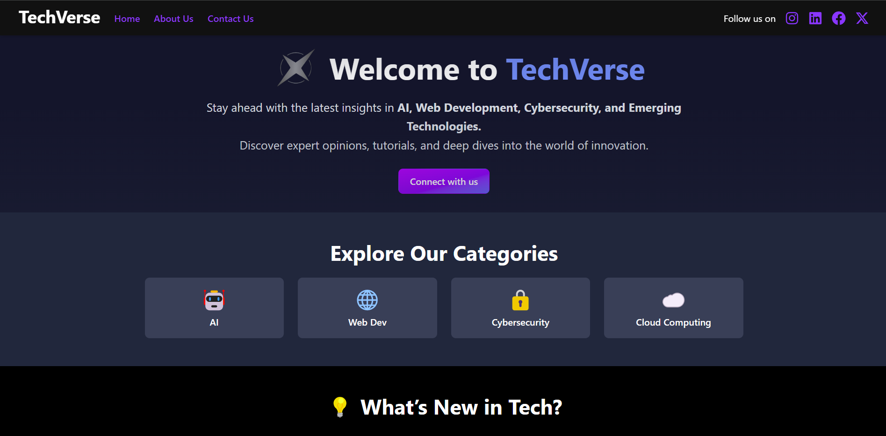

# TechVerse - A Tech Blog

TechVerse is a modern, tech-focused blog website built using **Vite** and **Tailwind CSS**. It provides a seamless experience for users to explore, publish, and stay updated with the latest technology trends.

## 📌 Features
-  Display of tech-related blogs with an eye-catching UI  
- Latest blog covers the full width and half the screen  
- Other blogs are displayed in a grid layout  
- Some column reserved for future ads  
- New blogs can be published easily 
- Fast and optimized with Vite & Tailwind CSS  

## 🛠 Tech Stack
**Frontend:** Vite, React, Tailwind CSS  
**Backend:** Node.js, Express, MongoDB Atlas

