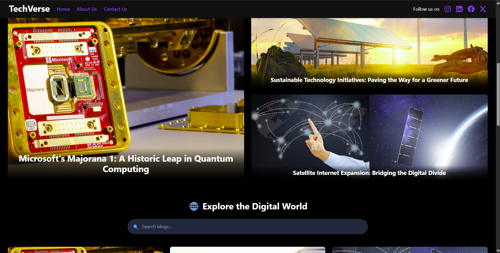

# 🚀 TechVerse – Digital Domain

**TechVerse** is a modern tech blog platform built for exploring and sharing the latest things in technology. From AI advancements to software dev tips, it brings together passionate minds under one digital roof.

---

## 🌟 Features

- 📚 **Dynamic Blog Listing** – Blogs automatically sorted by the latest date.
- 🔍 **Search Functionality** – Find blogs by title with real-time filtering.
- 📱 **Responsive UI** – Optimized layout for desktop, tablet, and mobile.
- 🌄 **Custom Blog Images** – Upload featured images for home, grid, and detail views.
- 🧭 **Smooth Navigation** – Intuitive routing using React Router.
- 🎨 **Dark-themed Modern UI** – Eye-friendly and clean user experience.

---

## 🛠️ Tech Stack

### Frontend
- **React.js**
- **React Router DOM**
- **Tailwind CSS**
- **Axios** (with a shared instance)
- **Vite** (for lightning-fast builds)

### Backend
- **Node.js**
- **Express.js**
- **MongoDB Atlas** 
- **Mongoose**
- **CORS & dotenv**

---

